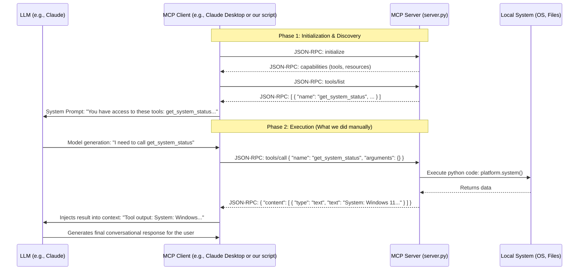

# MCP Architecture & Low-Level Understanding

You hit on a crucial concept: **The MCP server has absolutely no idea what an LLM is.** 

An MCP server is simply a standardized API that communicates using **JSON-RPC** over system streams (Standard Input/Standard Output). It is entirely decoupled from AI. 

Because it's just a standard protocol, *any* program can be a client. In `src/client.py`, you wrote a simple Python script to act as the client. It queried the server for tools and executed one, bypassing the need for an AI altogether.

## Architecture Diagram

When an LLM *is* involved (like when using Claude Desktop or an AI-powered IDE), the architecture looks like this:



## The Low-Level View (JSON-RPC)

Underneath the hood, MCP uses JSON-RPC 2.0 formatting. When our `src/client.py` called `session.list_tools()`, it actually sent a plain text string over `stdout` to the server process that looked exactly like this:

```json
{
  "jsonrpc": "2.0",
  "id": 1,
  "method": "tools/list"
}
```

The server process read that text, parsed the JSON, ran the corresponding function, and printed this back to `stdout`:

```json
{
  "jsonrpc": "2.0",
  "id": 1,
  "result": {
    "tools": [
      {
        "name": "get_system_status",
        "description": "Get the current system status...",
        "inputSchema": {
          "type": "object",
          "properties": {}
        }
      }
    ]
  }
}
```

## Summary
- **Server:** Exposes capabilities (Tools, Resources, Prompts) over JSON-RPC.
- **Client:** Manages the server process, handles the JSON-RPC communication, and formats the results.
- **LLM:** Only talks to the *Client*. It never talks to the *Server* directly. The Client tells the LLM what tools exist, the LLM asks the Client to run them, and the Client orchestrates the actual server request.
